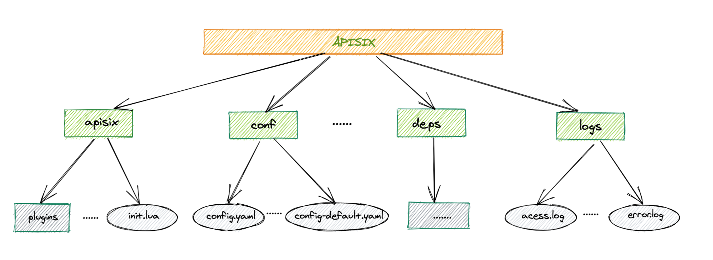

# APISIX 的 route 快速入门

本教程使用 rpm 包方式安装的 Apache APISIX ，在这之前你需要先安装 Apache APISIX。如何安装 Apache APISIX 请查看[安装文档](../install/centos7_rpm_install.md)。对于未接触过 APISIX 的初学者，当您读完本教程，可以了解到 APISIX 的 route 基本使用。

## 目录结构简介

主要目录结构：



1、conf 目录

APISIX 的配置文件目录，主要有 config.yaml 和 config-default.yaml 等文件。

`config.yaml` 与 `config-default.yaml` 文件是增量的关系，`config-default.yaml` 是 APISIX 的默认配置，若两个文件中存在相同字段信息的配置，以 `config.yaml` 中的配置生效。我们要修改 APISIX 配置信息，一般是在 `config.yaml` 中进行更改。

2、apisix 目录

主要用于存放 APISIX 的 lua 代码，例如 `plugins/` 目录下是各个插件的代码。

3、deps 目录

APISIX 的第三方各种依赖文件。

4、logs 目录

存放 APISIX 的日志文件，主要有 access.log 和 error.log 的日志文件。access.log 用于记录 APISIX 的请求访问日志，error.log 用于记录 APISIX 的错误日志信息。

## APISIX 的 route 使用

这里主要介绍 APISIX 的 route 使用，在这之前你需要先简单了解一下 APISIX 的 Route（路由）、Plugin（插件）、Upstream（上游）。

Route（路由）：与客户端请求匹配，并指定它们到达 APISIX 后如何发送到对应的 upstream 。

Plugin（插件）： 表示将在 HTTP 请求/响应生命周期期间执行的插件配置。plugin 配置可直接绑定在 Route 上，也可以被绑定在 Service 或 Consumer上。

Upstream（上游）：后端 API 服务，是一个虚拟主机抽象，它根据配置规则在给定的一组服务节点上执行负载平衡。因此，单个上游配置可以由提供相同服务的多个服务器组成。每个节点将包括一个 key（地址/ip:port）和一个 value （节点的权重）。服务可以通过轮询或一致哈希（cHash）机制进行负载均衡。

您可以通过查看 APISIX 的[架构文档](https://github.com/apache/apisix/blob/master/doc/architecture-design.md)来了解更多详细的信息。

在 APISIX 中提供了强大的 Admin API ，用于管理 APISIX 的配置信息。 下面的示例将会使用到 Admin API 接口，你可以通过查阅[admin-api](https://github.com/apache/apisix/blob/master/doc/admin-api.md)文档来了解更多详细信息。

### 代理请求

转发请求需要配置 route 的匹配规则和 upstream 信息。这里通过创建 route 并在路由中设置upstream 信息来实现请求的转发。这里使用 `httpbin` 模拟一个 API 服务，该服务可以回显发送到这个 API 请求数据。

**完全匹配 uri**

1、创建 route

创建一个 uri 为 `/get` ，路由 id 为 1，上游服务为 `httpbin.org` 的路由：

```shell
curl http://127.0.0.1:9080/apisix/admin/routes/1 -H 'X-API-KEY: edd1c9f034335f136f87ad84b625c8f1' -X PUT -d '
{
    "upstream": {
       "nodes": {
           "httpbin.org:80": 1
       },
       "type": "roundrobin"
    },
    "uri": "/get"
}'
```

2、测试

请求匹配 uri ，返回200状态码及响应数据：

```shell
$ curl http://127.0.0.1:9080/get -i
HTTP/1.1 200 OK
Content-Type: application/json
Content-Length: 299
Connection: keep-alive
Date: Thu, 31 Dec 2020 05:19:46 GMT
Access-Control-Allow-Origin: *
Access-Control-Allow-Credentials: true
Server: APISIX/2.1

{
  "args": {}, 
  "headers": {
    "Accept": "*/*", 
    "Host": "127.0.0.1", 
    "User-Agent": "curl/7.29.0", 
    "X-Amzn-Trace-Id": "Root=1-5ff14c2a-2d5f625a691b375f42afae70", 
    "X-Forwarded-Host": "127.0.0.1"
  }, 
  "origin": "127.0.0.1, 121.41.116.83", 
  "url": "http://127.0.0.1/get"
}
```

请求不匹配 uri， 返回404状态码：

```shell
$ curl http://127.0.0.1:9080/user-agent -i
HTTP/1.1 404 Not Found
Date: Thu, 31 Dec 2020 05:19:46 GMT
Content-Type: text/plain; charset=utf-8
Transfer-Encoding: chunked
Connection: keep-alive
Server: APISIX/2.1

{"error_msg":"404 Route Not Found"}
```

**前缀匹配 uri**

1、创建 route

创建一个前缀匹配 uri 为 `/*` ，路由 id 为 1，上游服务为 `httpbin.org` 的路由：

```shell
curl http://127.0.0.1:9080/apisix/admin/routes/1 -H 'X-API-KEY: edd1c9f034335f136f87ad84b625c8f1' -X PUT -d '
{
    "upstream": {
       "nodes": {
           "httpbin.org:80": 1
       },
       "type": "roundrobin"
    },
    "uri": "/*"
}'
```

2、测试

请求前缀匹配 uri ，返回200状态码及响应数据：

```shell
$ curl http://127.0.0.1:9080/get -i
HTTP/1.1 200 OK
Content-Type: application/json
Content-Length: 299
Connection: keep-alive
Date: Thu, 31 Dec 2020 05:29:46 GMT
Access-Control-Allow-Origin: *
Access-Control-Allow-Credentials: true
Server: APISIX/2.1

{
  "args": {}, 
  "headers": {
    "Accept": "*/*", 
    "Host": "127.0.0.1", 
    "User-Agent": "curl/7.29.0", 
    "X-Amzn-Trace-Id": "Root=1-5ff14c2a-2d5f625a691b375f42afae70", 
    "X-Forwarded-Host": "127.0.0.1"
  }, 
  "origin": "127.0.0.1, 121.41.116.83", 
  "url": "http://127.0.0.1/get"
}
```

```shell
$ curl http://127.0.0.1:9080/user-agent -i
HTTP/1.1 200 OK
Content-Type: application/json
Content-Length: 34
Connection: keep-alive
Date: Thu, 31 Dec 2020 05:29:46 GMT
Access-Control-Allow-Origin: *
Access-Control-Allow-Credentials: true
Server: APISIX/2.1

{
  "user-agent": "curl/7.29.0"
}
```

**条件匹配请求**

创建一个 uri 为 `/get` ，路由 id 为 1，上游服务为 `httpbin.org` ，并且限制 host 为 `test.com` 的路由 ：

```shell
curl http://127.0.0.1:9080/apisix/admin/routes/1 -H 'X-API-KEY: edd1c9f034335f136f87ad84b625c8f1' -X PUT -d '
{
    "upstream": {
       "nodes": {
           "httpbin.org:80": 1
       },
       "type": "roundrobin"
    },
    "hosts": ["test.com"],
    "uri": "/get"
}'
```

测试

请求 host 为 `test.com` ，匹配路由成功：

```shell
$ curl http://127.0.0.1:9080/get -i -H "host: test.com"
HTTP/1.1 200 OK
Content-Type: application/json
Content-Length: 296
Connection: keep-alive
Date: Thu, 31 Dec 2020 05:30:46 GMT
Access-Control-Allow-Origin: *
Access-Control-Allow-Credentials: true
Server: APISIX/2.1

{
  "args": {}, 
  "headers": {
    "Accept": "*/*", 
    "Host": "127.0.0.1", 
    "User-Agent": "curl/7.29.0", 
    "X-Amzn-Trace-Id": "Root=1-5ff14c2a-2d5f625a691b375f42afae70", 
    "X-Forwarded-Host": "127.0.0.1"
  }, 
  "origin": "127.0.0.1, 121.41.116.83", 
  "url": "http://127.0.0.1/get"
}
```

请求的 host 为 `foo.com` ，匹配路由失败：

```shell
$ curl http://127.0.0.1:9080/get -i -H "host: foo.com"
HTTP/1.1 404 Not Found
Date: Sat, 02 Jan 2021 05:05:02 GMT
Content-Type: text/plain; charset=utf-8
Transfer-Encoding: chunked
Connection: keep-alive
Server: APISIX/2.1

{"error_msg":"404 Route Not Found"}
```

**相同 uri 如何做选择**

当存在不同路由相同的 `uri` 时，我们可以通过设置路由的 `priority` 优先级属性来决定优先匹配哪个路由 ，或者给相同的路由增加匹配的条件来选择对应的路由。

1、不同路由具有相同 `uri` ，设置 `priority` 优先级属性

在相同的 `uri` 情况下，`priority` 值越大的路由，被匹配到的优先级越高。下面创建 id 为分别为 1 和 2 的两个路由，并且他们具有相同的 `uri` ，不同的 `priority` 值。其中 id 为1的路由上游地址可用，id 为2的路由上游地址不可用。

```shell
$ curl http://127.0.0.1:9080/apisix/admin/routes/1 -H 'X-API-KEY: edd1c9f034335f136f87ad84b625c8f1' -X PUT -d '
{
    "upstream": {
       "nodes": {
           "httpbin.org": 1
       },
       "type": "roundrobin"
    },
    "priority": 4,
    "uri": "/get"
}'
```

```shell
$ curl http://127.0.0.1:9080/apisix/admin/routes/2 -H 'X-API-KEY: edd1c9f034335f136f87ad84b625c8f1' -X PUT -d '
{
    "upstream": {
       "nodes": {
           "foo.com": 1
       },
       "type": "roundrobin"
    },
    "priority": 2,
    "uri": "/get"
}'
```

测试：

```shell
$ curl http://127.0.0.1:9080/get
{
  "args": {}, 
  "headers": {
    "Accept": "*/*", 
    "Host": "127.0.0.1", 
    "User-Agent": "curl/7.29.0", 
    "X-Amzn-Trace-Id": "Root=1-5ff00677-22097e9b10cb845d09dab360", 
    "X-Forwarded-Host": "127.0.0.1"
  }, 
  "origin": "127.0.0.1, 121.41.116.83", 
  "url": "http://127.0.0.1/get"
}
```

测试发现，无论请求多少次，请求命中的都是 id 为 1 的路由。

2、不同路由具有相同 uri，设置不同的匹配条件

这里通过设置路由的 `vars` 条件规则，来选择对应的路由，当然你也可以通过设置 `hosts` 属性达到相同的效果。关于 vars 与 hosts 的使用，你可以查阅[admin-api](https://github.com/apache/apisix/blob/master/doc/admin-api.md)文档了解更多。

创建 id 为1的路由，uri 为 `/get` ，上游地址可用，并且请求头 `appkey` 为 `id_1`：

```shell
curl http://127.0.0.1:9080/apisix/admin/routes/1 -H 'X-API-KEY: edd1c9f034335f136f87ad84b625c8f1' -X PUT -d '
{
    "upstream": {
       "nodes": {
           "httpbin.org:80": 1
       },
       "type": "roundrobin"
    },   
    "vars": [["http_appkey","==","id_1"]],
    "uri": "/get"
}'
```

创建 id 为2的路由，uri 为 `/get` ，上游地址不可用，并且请求头 `appkey` 为 `id_2`：

```shell
curl http://127.0.0.1:9080/apisix/admin/routes/2 -H 'X-API-KEY: edd1c9f034335f136f87ad84b625c8f1' -X PUT -d '
{
    "upstream": {
       "nodes": {
           "foo.com": 1
       },
       "type": "roundrobin"
    },
   
    "vars": [["http_appkey","==","id_2"]],
    "uri": "/get"
}'
```

测试：

请求头 `appkey` 为 `id_1`，命中 id 为1的路由：

```shell
$ curl http://127.0.0.1:9080/get -H "appkey: id_1"
{
  "args": {}, 
  "headers": {
    "Accept": "*/*", 
    "Appkey": "id_1", 
    "Host": "127.0.0.1", 
    "User-Agent": "curl/7.29.0", 
    "X-Amzn-Trace-Id": "Root=1-5ff00d24-3cb246ee3598c054437fa7f2", 
    "X-Forwarded-Host": "127.0.0.1"
  }, 
  "origin": "127.0.0.1, 121.41.116.83", 
  "url": "http://127.0.0.1/get"
}
```

请求头 `appkey` 为 `id_2`，命中 id 为2的路由：

```shell
$ curl http://127.0.0.1:9080/get -H "appkey: id_2"

bad request, invalid domain
```

### 启用插件

在 route 上启用插件，只需要在 route 上配置相关的插件信息，这里以启用 `limit-count` 插件为例，更多插件的使用请查看[官方插件文档](https://github.com/apache/apisix/tree/master/doc/plugins)。

开启 limit-count 插件，每一分钟只允许访问两次，如果超过两次，则返回 503 状态码：

```shell
$ curl http://127.0.0.1:9080/apisix/admin/routes/1 -H 'X-API-KEY: edd1c9f034335f136f87ad84b625c8f1' -X PUT -d '
{
    "upstream": {
       "nodes": {
           "httpbin.org:80": 1
       },
       "type": "roundrobin"
    },   
    "plugins": {        
        "limit-count": {
            "count": 2,
            "time_window": 60,
            "rejected_code": 503,
            "key": "remote_addr"
        }
    },
    "uri": "/get"
}'
```

测试：

```shell
#第一次请求
$ curl http://127.0.0.1:9080/get -i
HTTP/1.1 200 OK
Content-Type: application/json
Content-Length: 299
Connection: keep-alive
X-RateLimit-Limit: 2
X-RateLimit-Remaining: 1
......

#第二次请求
$ curl http://127.0.0.1:9080/get -i
HTTP/1.1 200 OK
Content-Type: application/json
Content-Length: 299
Connection: keep-alive
X-RateLimit-Limit: 2
X-RateLimit-Remaining: 0
......

#第三次请求
$ curl http://127.0.0.1:9080/get -i
HTTP/1.1 503 Service Temporarily Unavailable
Date: Thu, 31 Dec 2020 05:50:4 GMT
Content-Type: text/html; charset=utf-8
Content-Length: 194
Connection: keep-alive
Server: APISIX/2.1
......
```

可以看到 limit-count 插件生效。

### 移除插件

当你想移除 `limit count` 插件的时候，很简单，在插件的配置中把对应的 json 配置删除即可，无须重启服务，即刻生效：

```shell
curl http://127.0.0.1:9080/apisix/admin/routes/1 -H 'X-API-KEY: edd1c9f034335f136f87ad84b625c8f1' -X PUT -d '
{
    "upstream": {
       "nodes": {
           "httpbin.org:80": 1
       },
       "type": "roundrobin"
    },   
    "plugins": {},
    "uri": "/get"
}'
```

现在就已经移除了 `limit count` 插件了。其他插件的开启和移除也是同样的方法。

### 删除路由

当你想对已经创建的路由进行删除时，你可以通过路由 id 的方式进行删除指定路由。例如执行下面命令删除 id 为 1 的路由：

```shell
$ curl http://127.0.0.1:9080/apisix/admin/routes/1 -H 'X-API-KEY: edd1c9f034335f136f87ad84b625c8f1' -X DELETE

{"header":{"raft_term":"25","member_id":"10276657743932975437","revision":"23643","cluster_id":"14841639068965178418"},"deleted":"1","key":"\/apisix\/routes\/1","node":{},"action":"delete"}
```

## 总结

本教程主要介绍了 APISIX 的 route 相关使用，让你快速的对 APISIX 的 route 部分有个基本的了解和认识。
