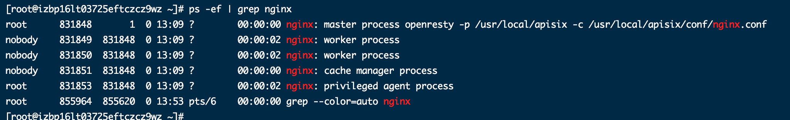
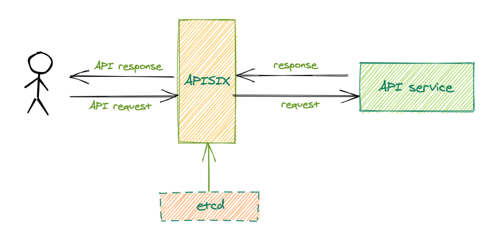

# 两步完成 APISIX 在 CentOS 7 安装

## Apache APISIX 是什么？

Apache APISIX 是一个动态、实时、高性能的 API 网关，基于 Nginx 网络库和 etcd 实现， 提供负载均衡、动态上游、灰度发布、服务熔断、身份认证、可观测性等丰富的流量管理功能。

你可以使用 Apache APISIX 来处理传统的南北向流量，以及服务间的东西向流量， 也可以当做 Kubernetes ingress controller 来使用。

Apache APISIX的技术架构：


## 简介

如何在 CentOS 7 上成功安装并运行 APISIX 服务，本教程将依据 [APISIX 官方文档](https://github.com/apache/apisix/blob/master/README.md)，将带你从零搭建 APISIX 服务，适用人群：

1、未接触过 APISIX 的初学者；

2、想简单快速部署 APISIX 者；

## 如何快速安装 APISIX

### 依赖安装

1、etcd 安装

```bash
# 下载 etcd 安装包
$ wget https://github.com/etcd-io/etcd/releases/download/v3.4.13/etcd-v3.4.13-linux-amd64.tar.gz

# 解压安装
$ tar -xvf etcd-v3.4.13-linux-amd64.tar.gz && \
    cd etcd-v3.4.13-linux-amd64 && \
    sudo cp -a etcd etcdctl /usr/bin/

# 开启 etcd 服务
$ nohup etcd &
```

>注意：Apache APISIX 从 v2.0 开始不再支持 etcd v2 协议，并且 etcd 最低支持版本为 v3.4.0

2、OpenResty 和 curl 安装

```bash
# 添加 OpenResty 源
$ sudo yum install yum-utils
$ sudo yum-config-manager --add-repo https://openresty.org/package/centos/openresty.repo

# 安装 OpenResty 和 curl
$ sudo yum install -y openresty curl

# OpenResty 安装好后，默认是开启的，我们需要关闭它
$ openresty -s stop
```

> OpenResty 版本建议不小于 1.17.8.2 。

### 安装 APISIX

1、安装 APISIX

```shell
$ sudo yum install -y https://github.com/apache/apisix/releases/download/2.1/apisix-2.1-0.el7.noarch.rpm
```

安装指定版本，只需要修改 APISIX 对应版本号，例如安装 2.0 版本，只需要将版本号改为 `.../download/2.0/apisix-2.0-0.el7.noarch.rpm` 。相应版本信息请查看[APISIX 官方发布版本](https://github.com/apache/apisix/releases)

```shell
$ sudo yum install -y https://github.com/apache/apisix/releases/download/2.0/apisix-2.0-0.el7.noarch.rpm
```

2、检查 APISIX 的版本号

```shell
$ apisix version

2.1
```

3、启动 APISIX

```shell
$ apisix start
```

4、查看 APISIX 启动情况



可以看到 APISIX 服务进程信息，说明启动成功。

## 验证 APISIX 服务

请求的简单流程图：


1、创建路由

这里使用 `httpbin` 工具模拟一个 API 服务，该服务可以回显发送到这个 API 请求数据。创建一个 id 为 1 的路由：

```shell
curl http://127.0.0.1:9080/apisix/admin/routes/1 -H 'X-API-KEY: edd1c9f034335f136f87ad84b625c8f1' -X PUT -d '
{
    "upstream": {
       "nodes": {
           "httpbin.org:80": 1
       },
       "type": "roundrobin"
    },
    "uri": "/get"
}'

```

2、测试

通过执行下面命令，返回 200 状态码及相应数据，说明 APISIX 服务能正常：

```shell
$ curl http://127.0.0.1:9080/get -i
HTTP/1.1 200 OK
Content-Type: application/json
Content-Length: 299
Connection: keep-alive
Server: APISIX/2.1
Date: Thu, 31 Dec 2020 05:19:46 GMT
......
```

## 总结

本教程主要是站在 APISIX 初学者的角度，基于 CentOS 7 快速部署 APISIX 服务，并做了一个简单的代理请求验证。

更多安装方式请查看 [APISIX 官方文档](https://github.com/apache/apisix/blob/master/README.md) ，后续也会增加其它的安装方式。
